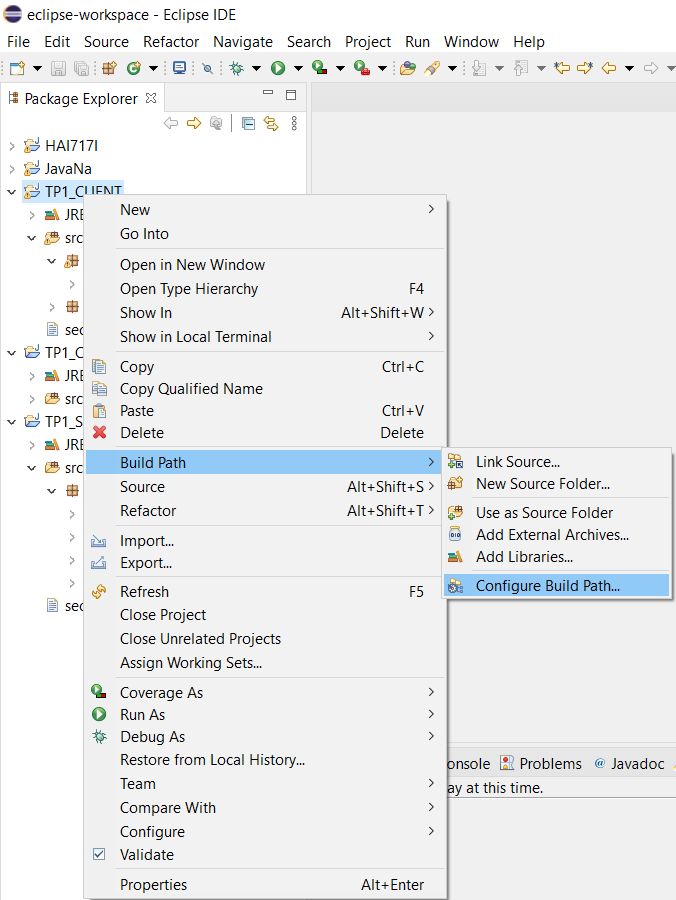
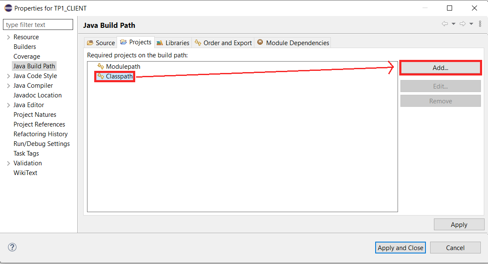
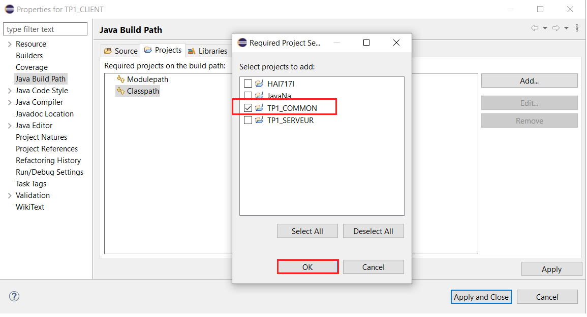

# TP_RMI

Télécharger le dossier `TP_RMI`.
> ⚠️ Le chemin vers ce dossier ne doit pas contenir d'espace auquel cas une exception de type MalformedUrlException sera affichée.

### SCENARIO SANS CODEBASE

####Installation 
Ouvrir les dossiers `TP1_COMMON`,`TP1_CLIENT` et `TP1_SERVEUR_SANS_CODEBASE` comme projet sur Eclipse.

Pour les projets `TP1_CLIENT` et `TP1_SERVEUR_SANS_CODEBASE` il faut définir le classpath  comme étant le projet `TP1_COMMON` (si ce n'est pas fait automatiquement) :

####Exécution
On commence par lancer le serveur, puis on lance le client, à l'aide du bouton `run` sous Eclipse.

### SCENARIO AVEC CODEBASE

####Installation 
Ouvrir les dossiers `TP1_COMMON`,`TP1_CLIENT` et `TP1_SERVEUR` comme projets sur Eclipse.

Pour les projets `TP1_CLIENT` et `TP1_SERVEUR` il faut définir le classpath comme étant le projet `TP1_COMMON` (si ce n'est pas fait automatiquement) :

####Exécution
On commence par lancer le serveur, puis on lance le client, à l'aide du bouton `run` sous Eclipse.

